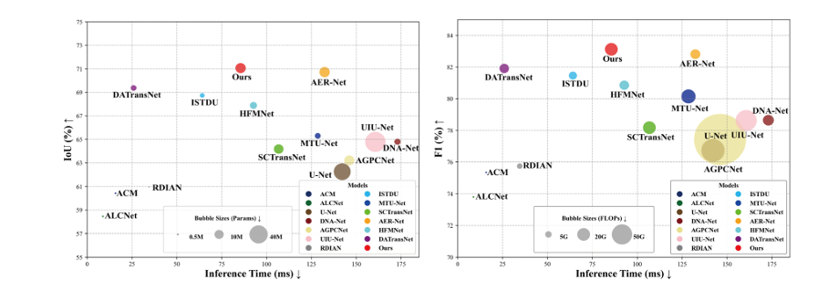
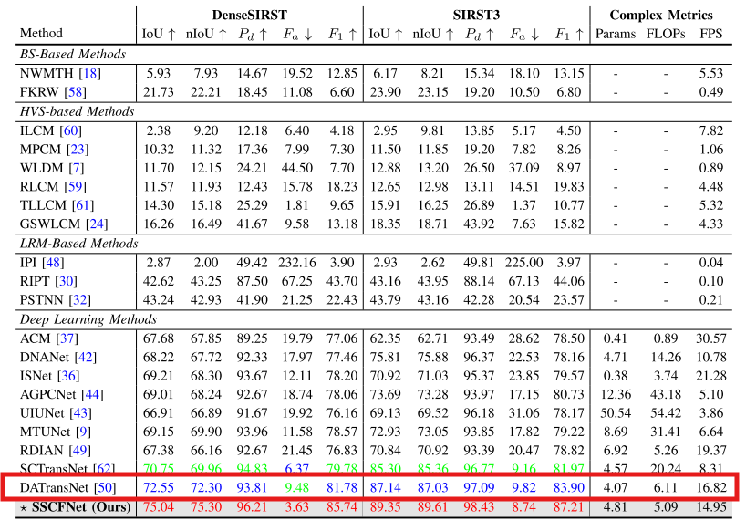

# DATransNet: Dynamic Attention Transformer Network for Infrared Small Target Detection

 Official implementation of paper "DATransNet: Dynamic Attention Transformer Network for Infrared Small Target Detection". 
 Our paper is accepted in [GRSL](https://ieeexplore.ieee.org/document/10947728).

# Network Structure


# Requirements

* **Python 3.8**
* **Windows10, Ubuntu18.04 or higher**
* **NVDIA GeForce RTX 4080**
* **Pytorch 1.13.0**
* **More details from requirements.txt**

# Dataset

Or you can download in [Baidu Cloud](https://pan.baidu.com/s/19DOSJZTHC0KO-wKyGRSldQ?pwd=mxhe) with code of "mxhe".

# Commands for Training

* **Run train.py to train our network**
  ```Run
  Python train.py
  ```

# Cited by

[《Adaptive Strategies for Multiscale Gradient Fusion in Neural Networks》](https://www.researchgate.net/profile/Xinyi-Zhang-235/publication/385103761_Adaptive_Strategies_for_Multiscale_Gradient_Fusion_in_Neural_Networks/links/6716a74209ba2d0c76174965/Adaptive-Strategies-for-Multiscale-Gradient-Fusion-in-Neural-Networks.pdf) indicates that our network is suitable for the tasks of visual light targets detection.

[《Hybrid attention and adaptive feature fusion network for infrared small target detection》](https://www.sciencedirect.com/science/article/pii/S0143816625003999) shows a good balance in computation cost and precision among other models


[《When Clusters Meet Shape Priors: A Synergistic Framework for Cluster Infrared Small Target Detection》](https://ieeexplore.ieee.org/document/11164479) shows a good performance in the two new datasets.




[《Frequency Introduced Cascade Feature Fusion Network via Knowledge Distillation for Infrared Small Target Detection》](https://ieeexplore.ieee.org/document/11236448) shows a good performance in the two new datasets.

# Citation

```Citation
@ARTICLE{10947728,
  author={Hu, Chen and Huang, Yian and Li, Kexuan and Zhang, Luping and Long, Chang and Zhu, Yiming and Pu, Tian and Peng, Zhenming},
  journal={IEEE Geoscience and Remote Sensing Letters}, 
  title={DATransNet: Dynamic Attention Transformer Network for Infrared Small Target Detection}, 
  year={2025},
  volume={},
  number={},
  pages={1-1},
  keywords={Feature extraction;Transformers;Data mining;Training;Object detection;Image edge detection;Head;Measurement;Geoscience and remote sensing;Artificial intelligence;Infrared small target detection (ISTD);convolution neural network (CNN);Dynamic Attention Transformer;global feature extraction},
  doi={10.1109/LGRS.2025.3557021}}
```
# Chinese Introduction
The chinese introduction is accessiable at [https://blog.csdn.net/weixin_45358930/article/details/147562104?spm=1001.2014.3001.5501](https://blog.csdn.net/weixin_45358930/article/details/147562104?spm=1001.2014.3001.5501).
# Weights

We could offer the weights for IRSTD-1K [Weight_for_IRSTD_1K](best_ckpt_for_IRSTD_1K.pth.tar) and NUDT-SIRST [weight_for_NUDT_SIRST](best_ckpt_fot_NUDT_IRSTD.pth.tar).
