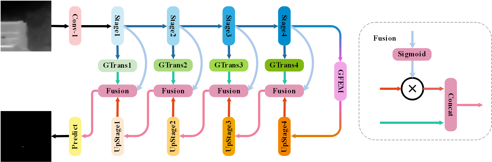
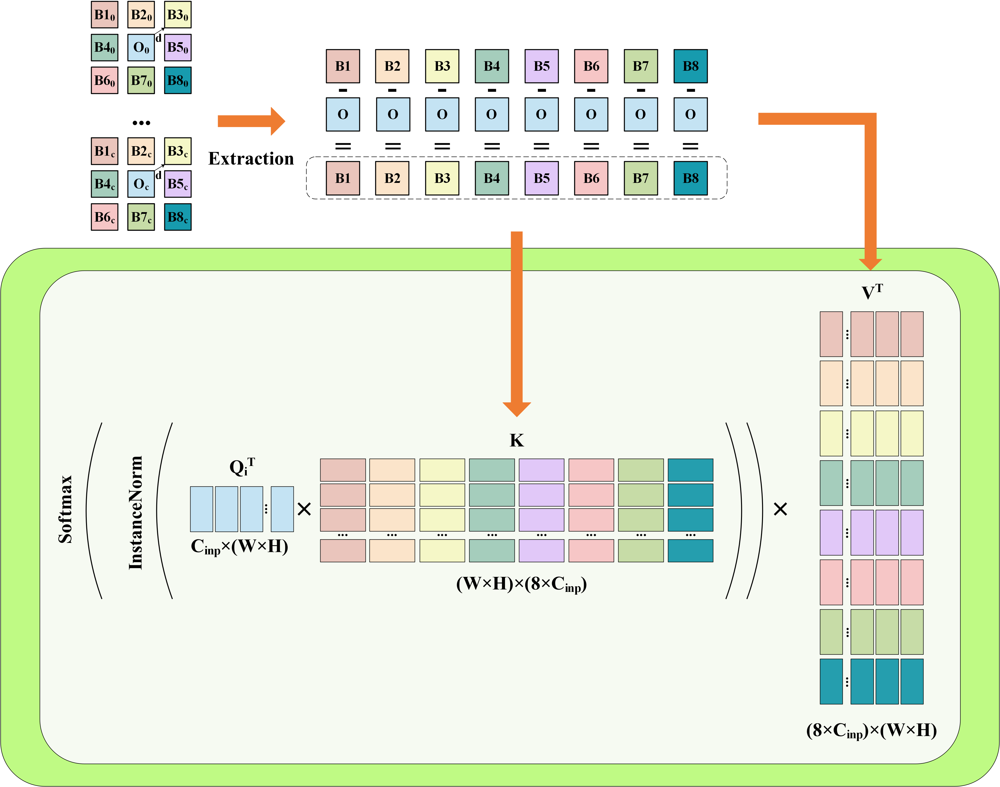
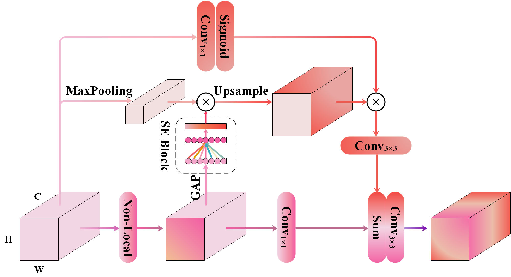

# Spatial Gradients Matter: Gradient-Based Attention Fusion for Infrared Small Target Detection

 Official implementation of paper "Spatial Gradients Matter: Gradient-Based Attention Fusion for Infrared Small Target Detection".

# Network Structure

# Requirements

* **Python 3.8**
* **Windows10, Ubuntu18.04 or higher**
* **NVDIA GeForce RTX 4080**
* **Pytorch 1.13.0**
* **More details from requirements.txt**

# Dataset

We used NUDT-SIRST and IRSTD-1K for training. The two datasets could be found and downloaded in: [NUDT-SIRST](https://github.com/YeRen123455/Infrared-Small-Target-Detection) and [IRSTD-1K](https://github.com/RuiZhang97/ISNet).

Please place these datasets to the folder ./datasets.
├── NUDT-SIRST/
│   ├── trainval/
│   │   ├── images/
│   │   │   ├── 000002.png
│   │   │   ├── 000004.png
│   │   │   └── ...
│   │   ├── masks/
│   │   │   ├── 000002.png
│   │   │   ├── 000004.png
│   │   │   └── ...
│   └── test/
│       ├── images/
│       │   ├── 000001.png
│       │   ├── 000003.png
│       │   └── ...
│       ├── masks/
│       │   ├── 000001.png
│       │   ├── 000003.png
│       │   └── ...
├── IRSTD-1k/
│   └── [same structure as NUDT-SIRST]
└── sirst_aug/
    └── [same structure as NUDT-SIRST]

# Commands for Training

* **Run train_7.py to train our network**
  > Python train_7.py
  >

# Cited by

[《Adaptive Strategies for Multiscale Gradient Fusion in Neural Networks》](https://www.researchgate.net/profile/Xinyi-Zhang-235/publication/385103761_Adaptive_Strategies_for_Multiscale_Gradient_Fusion_in_Neural_Networks/links/6716a74209ba2d0c76174965/Adaptive-Strategies-for-Multiscale-Gradient-Fusion-in-Neural-Networks.pdf) indicates that our network is suitable for the tasks of visual light targets detection.
